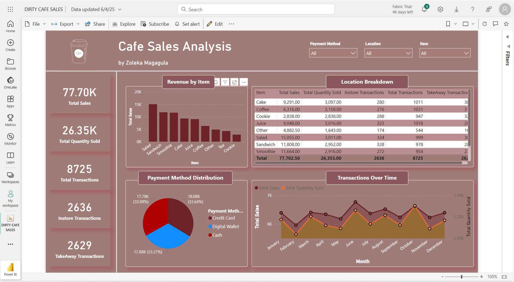

# PowerBI-Cafe-Sales-Analysis ☕
This project focused on data cleaning using a 10,000-row synthetic cafe sales dataset intentionally filled with missing values, inconsistencies, and errors to simulate real-world scenarios for cleaning and exploratory data analysis (EDA).

## Project Objective
To analyze and compare customer purchasing behavior between in-store and takeaway transactions at a café using Power BI. This project aims to uncover sales trends, total quantities sold, and transactional patterns to provide actionable insights that support data-driven decision-making for operational and marketing improvements

**Data Cleaning Steps:**

1. **Handled Missing and Invalid Values:** Replaced empty values, as well as entries labeled `'unknown'` and `'error'`, with `'Other'` in the `Item`, `Location`, and `Payment Method` columns.

2. **Fixed Data Types:** Converted the `Price Per Unit` column from text to numeric by replacing period (`.`) separators with commas (`,`).

3. **Calculated Missing Totals:** For rows where `Total Spent` was null but both `Quantity` and `Price Per Unit` were valid numbers, I used the following M code to compute the missing values:

```m
if [Total Spent] = null and 
   [Quantity] <> null and 
   [Price Per Unit] <> null and 
   Value.Is([Quantity], type number) and 
   Value.Is([Price Per Unit], type number) then
    [Quantity] * [Price Per Unit]
else
    [Total Spent]
```

## 📊 DAX Measures Created

This section highlights key DAX measures I created to analyze customer purchasing behavior using the `dirty_cafe_sales` dataset. These measures were used in Power BI to build visuals that compare takeaway vs in-store activity, as well as track overall performance.

```DAX
1. In-store Transactions
Instore Transactions = 
CALCULATE(
    COUNTROWS(dirty_cafe_sales), 
    'dirty_cafe_sales'[Location] = "In-store"
)

2. Takeaway Transactions
TakeAway Transactions = 
CALCULATE(
    COUNTROWS(dirty_cafe_sales), 
    'dirty_cafe_sales'[Location] = "Takeaway"
)

3. Total Quantity Sold
Total Quantity Sold = 
SUM(dirty_cafe_sales[Quantity])

4. Total Sales
Total Sales = 
SUM(dirty_cafe_sales[Total Spent])

5. Total Transactions
Total Transactions = 
COUNTROWS(dirty_cafe_sales)
```


## How to Use
Download the `.pbix` file and open it in Power BI Desktop.
## Dashboard Preview



## INSIGHTS FROM DASHBOARD
### Key Business Insights from Café Sales Data
**Salad Tops Revenue Generation**
Salad is the café’s top-performing item, generating a total of $15,055 in revenue. This surpasses the second highest-grossing item — the sandwich — which brings in $11,808, revealing a notable revenue gap of over $3,000.
Both items are primarily purchased in-store, indicating that customers prefer to enjoy these meals on-site, possibly due to freshness or presentation quality.

**Balanced Payment Preferences**
There is a relatively even distribution across the three main payment methods: Credit Card, Digital Wallet, and Cash. This suggests that the café caters well to diverse customer preferences and that no single payment method dominates, highlighting the importance of maintaining multiple secure payment options.

**July Sees Peak Sales Volume**
Sales data indicates that July experiences the highest volume of transactions across multiple items. This peak aligns with the summer season, suggesting a seasonal increase in customer traffic and potentially higher demand for lighter, refreshing items like salads, smoothies, and juices. The café may consider seasonal promotions or extended hours during this period to maximize sales.

### Proposals
To attract more customers and boost coffee sales, I recommend that the café expand its variety of coffee options. A diverse coffee menu could appeal to a wider range of customer preferences and increase overall purchases.

Additionally, the sales data reveals that cookies generate the least revenue and are the only item where total sales equal total quantity sold. This suggests that the café may not be profiting from cookie sales. To address this, I recommend a **modest price increase—enough** to ensure some profit without discouraging purchases.
